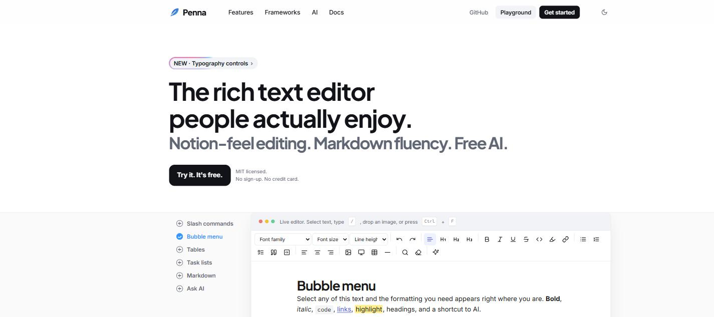

<div align="center">


# Penna

**The rich text editor people actually enjoy.**

Notion-feel editing, lossless Markdown, real tables and media, typography controls, and free AI.<br/>
One small package that drops into React, Vue, Angular, Svelte, Solid or plain HTML.

[](https://www.npmjs.com/package/@abhinavakhil/penna-core)
[](https://www.npmjs.com/package/@abhinavakhil/penna-core)
[](https://bundlephobia.com/package/@abhinavakhil/penna-core)
[](LICENSE)
[](https://github.com/abhinavakhil/Penna/stargazers)
[](tsconfig.base.json)

[Playground](https://penna.vercel.app/playground) · [Docs](https://penna.vercel.app/docs) · [npm](https://www.npmjs.com/package/@abhinavakhil/penna-core) · [Angular demo](https://codesandbox.io/p/devbox/sqxfhh) · [Issues](https://github.com/abhinavakhil/Penna/issues)

</div>

<p align="center">
  <a href="https://penna.vercel.app"></a>
</p>

<p align="center">
  <sub><em>Edit here. Display there. Same pixels.</em></sub>
</p>

---

## Why Penna?

Most editors make you choose. React-only, or a jQuery-era API. Five plugins from five authors for tables,
images, embeds, find and replace, and task lists. AI locked to one vendor's paywall.

Penna is one import, tested together and styled together. The editor is a plain DOM element with thin
React and Vue wrappers and a web component for everything else. Content is stored as JSON and rendered
with the same serializer inside the editor, in read-only mode, on the server, or in an email, so nothing
drifts out of sync.

| | Penna | Novel | Quill | Froala |
|---|:---:|:---:|:---:|:---:|
| Works in any framework | ✅ | React only | Vanilla + wrappers | jQuery-era API |
| Slash commands and bubble menu | ✅ | ✅ | ✗ | Partial |
| Tables with merge and resize | ✅ | ✗ | Plugin | ✅ |
| Lossless Markdown in and out | ✅ | Input only | ✗ | ✗ |
| Render content without the editor | ✅ no DOM | ✗ | ✗ | ✗ |
| Built-in AI | ✅ free providers | OpenAI only | ✗ | ✗ |
| License | MIT, no telemetry | Apache-2.0 | BSD | Paid |

<sub>Default, out-of-the-box behaviour of each project at time of writing.</sub>

---

## Write like it's Notion.

*Type `/`, select text, drag a block. The rest stays out of your way.*

- **Slash commands →** 16 blocks: headings, lists, tables, images, video, embeds, callouts, code, and AI. Fuzzy search, keyboard first.
- **Bubble menu →** Select text and the formatting you need appears right there. Bold, links, highlight, headings, AI.
- **Drag handles →** Grab any block and move it. Click `+` to insert below.
- **Markdown in and out →** Type `**bold**`, `# heading`, `- [ ] task` and it converts as you go. Import and export lossless Markdown, HTML or JSON.
- **Find and replace →** Match counts, case toggle, replace all. `Ctrl+F` like you'd expect.

## Real content, not afterthoughts.

*Tables that merge. Media that resizes. Embeds that just become the thing.*

- **Tables →** Add rows and columns, merge cells, header rows, drag to resize.
- **Images and video →** Drop, paste or upload. Resize by dragging, align, alt text. Inline by default or bring your own storage.
- **Embeds →** Paste a YouTube, Vimeo, Loom, Figma or CodePen link on an empty line.
- **Task lists →** Real checkboxes that toggle, serialize to `- [x]`, and render outside the editor.
- **Typography →** Heading and body font families, font size, and line height per block. Fonts stay under your control; Penna never downloads any.

## AI, without the bill.

*Free providers out of the box. Paid models if you want them.*

- **Free presets →** Groq, Gemini, OpenRouter and Together, all with free tiers. Ollama for fully local.
- **Any OpenAI-compatible endpoint →** OpenAI, Mistral or your own proxy is one line of config.
- **Every writing action →** Continue, improve, fix grammar, shorten, expand, simplify, summarize, translate, change tone, or type any instruction.
- **Preview before insert →** Responses stream into a preview. Accept, retry or discard. Nothing touches the document until you say so.
- **Your key stays yours →** Requests go from the browser straight to the provider you chose. Nothing is sent until you trigger an action.

## Make it yours.

*Every color is a CSS variable. Every class is stable and prefixed.*

- **Dark mode →** Follows the system, or force it.
- **Theming →** One `penna.css`, all tokens on `.penna`. Match your brand in a line.
- **Render anywhere →** `renderToHTML(json)` needs no DOM. Server, edge, worker, email, PDF pipeline.
- **Extensions →** An extension is a plain object. The AI package is built the same way you would build yours.
- **Autosave, word count, read time →** Built in, off by default, one option each.

---

## Get started

```sh
npm i @abhinavakhil/penna-core
```

Then pick your framework. Same editor, same features, same CSS file.

<details open>
<summary><b>Plain HTML</b> (one script tag, no build step)</summary>

<br/>

```html
<link rel="stylesheet" href="https://unpkg.com/@abhinavakhil/penna-core/dist/penna.css">
<script type="module" src="https://unpkg.com/@abhinavakhil/penna-element"></script>

<penna-editor placeholder="Write something…"></penna-editor>
```

</details>

<details>
<summary><b>React</b></summary>

<br/>

```tsx
import { Penna } from '@abhinavakhil/penna-react'
import '@abhinavakhil/penna-core/penna.css'

export default function Page() {
  const [html, setHtml] = useState('')
  return <Penna value={html} onChange={({ html }) => setHtml(html)} />
}
```

</details>

<details>
<summary><b>Vue</b></summary>

<br/>

```vue
<script setup>
import { Penna } from '@abhinavakhil/penna-vue'
import '@abhinavakhil/penna-core/penna.css'
const html = ref('')
</script>

<template>
  <Penna v-model="html" placeholder="Write something…" />
</template>
```

</details>

<details>
<summary><b>Angular</b> (web component) · <a href="https://codesandbox.io/p/devbox/sqxfhh">live demo</a></summary>

<br/>

```ts
// main.ts, registers <penna-editor>
import '@abhinavakhil/penna-element'
```

```css
/* styles.css */
@import "@abhinavakhil/penna-core/penna.css";
```

```ts
@Component({
  selector: 'app-root',
  standalone: true,
  schemas: [CUSTOM_ELEMENTS_SCHEMA],
  template: `<penna-editor [value]="html" (change)="html = $any($event).detail.html"></penna-editor>`,
})
export class AppComponent { html = '<p>Hello</p>' }
```

</details>

<details>
<summary><b>Svelte, Solid, Lit, anything else</b> (web component)</summary>

<br/>

```ts
import '@abhinavakhil/penna-element'
import '@abhinavakhil/penna-core/penna.css'
```

```html
<penna-editor value={html} on:change={(e) => (html = e.detail.html)} />
```

</details>

<details>
<summary><b>Vanilla JS</b></summary>

<br/>

```ts
import { createEditor } from '@abhinavakhil/penna-core'
import '@abhinavakhil/penna-core/penna.css'

const editor = createEditor('#editor', {
  placeholder: 'Write something…',
  onUpdate: (e) => save(e.getJSON()),
})
```

</details>

### Add AI

```ts
import { createEditor } from '@abhinavakhil/penna-core'
import { ai } from '@abhinavakhil/penna-ai'

createEditor('#editor', {
  extensions: [ai({ provider: 'groq', apiKey: GROQ_KEY })], // free at console.groq.com
})
```

### Angular

```sh
npm i @abhinavakhil/penna-angular @abhinavakhil/penna-core
```

```ts
import { PennaEditorComponent, providePenna } from '@abhinavakhil/penna-angular'

// app-wide defaults (optional)
bootstrapApplication(App, { providers: [providePenna({ theme: 'auto', extensions: [shortcuts()] })] })

@Component({
  imports: [PennaEditorComponent, FormsModule],
  template: `<ngx-penna [(ngModel)]="html" placeholder="Write…" theme="dark" />`,
})
```

Works with `ngModel`, `formControl` / `formControlName` (disabled → read-only), or `[(value)]`. Add `penna.css` to `styles` in `angular.json`. See [`packages/angular/README.md`](packages/angular/README.md).

### Themes and direction

`theme: 'auto' | 'light' | 'dark' | 'sepia'`. On `auto` the editor follows a `data-theme="dark"` or `.dark` ancestor, then the OS. Every color is a `--pn-*` CSS variable. `dir: 'rtl'` mirrors lists, quotes and menus for Arabic, Urdu and Hebrew.

### Extensions

All opt-in, all in `@abhinavakhil/penna-core`:

```ts
import { shortcuts, fundraisingShortcuts, proofread, focusMode, versionHistory, mentions, mergeFields, comments } from '@abhinavakhil/penna-core'

createEditor('#editor', { extensions: [
  shortcuts({ items: fundraisingShortcuts }),   // /budget, /impact, /milestones + Ctrl+Alt+B/I/M; select text → + saves your own
  proofread({ onChange: (s) => console.log(s.score) }), // spelling, wordy phrases, long sentences; decorations only
  mentions({ items: (q) => api.people(q) }),    // @Name
  mergeFields({ fields: [{ key: 'first_name' }] }), // {{first_name}}; .setPreview({ first_name: 'Aisha' })
  comments({ onAdd: (c) => api.thread(c) }),    // anchors only; threads live in your DB
  versionHistory({ key: 'post-42' }),           // autosave snapshots, word diff, restore
  focusMode(),                                  // sentence focus + typewriter scrolling
] })
```

Shortcuts are plain Penna content (HTML or Markdown), so anything they insert stays editable. Pass your own `items`, or sync the ones people save with `onChange`.

### Render saved content without the editor

```ts
import { renderToHTML } from '@abhinavakhil/penna-core'

const html = renderToHTML(post.content) // same markup, same penna.css
```

---

## Packages

| Package | Version | What it is |
|---|---|---|
| [`@abhinavakhil/penna-core`](https://www.npmjs.com/package/@abhinavakhil/penna-core) | [](https://www.npmjs.com/package/@abhinavakhil/penna-core) | The editor, `renderToHTML`, and `penna.css` |
| [`@abhinavakhil/penna-element`](https://www.npmjs.com/package/@abhinavakhil/penna-element) | [](https://www.npmjs.com/package/@abhinavakhil/penna-element) | `<penna-editor>` web component for any framework |
| [`@abhinavakhil/penna-react`](https://www.npmjs.com/package/@abhinavakhil/penna-react) | [](https://www.npmjs.com/package/@abhinavakhil/penna-react) | React wrapper |
| [`@abhinavakhil/penna-vue`](https://www.npmjs.com/package/@abhinavakhil/penna-vue) | [](https://www.npmjs.com/package/@abhinavakhil/penna-vue) | Vue wrapper |
| `@abhinavakhil/penna-angular` | new | Angular component (ngModel, reactive forms, SSR-safe) |
| [`@abhinavakhil/penna-ai`](https://www.npmjs.com/package/@abhinavakhil/penna-ai) | [](https://www.npmjs.com/package/@abhinavakhil/penna-ai) | AI extension with free provider presets |

## Develop

```sh
pnpm install
pnpm dev        # site + playground on http://localhost:4321
pnpm test
pnpm typecheck
pnpm build
```

Penna never ships or stores API keys. The playground keeps any key you enter in your browser's
localStorage only. Local secrets belong in `.env` files, which are git-ignored.

## Contributing

Issues and pull requests are welcome. Open an issue first for anything bigger than a bug fix so we can
agree on the shape before you spend time on it.

## License

[MIT](LICENSE). No telemetry, ever.
